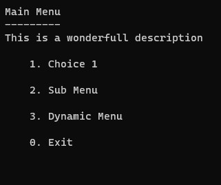

# MenuCLI

The objective of this library is to greatly simplify the creation of console app tools, by handling for you the basics of user control, and let you focus on your business value.

The focus here is efficiency and simplicity. This is not a library to draw a complex dashboard in ASCII art.

## Basic Setup

- Install the [nuget package](https://www.nuget.org/packages/MenuCLI/)
- Add a class that looks like that:
```cs
[Menu("This is a title", Description = "This is an optional description")]
public class MainMenu
{
    [Choice("This is the display text of the first choice")]
    public void Choice1()
    {
        Console.WriteLine("Hello world !");
    }

    [Choice("This is the display text of the second choice")]
    public void Choice2()
    {
        Console.WriteLine("Goodbye world !");
    }
}
```
- Add this code in your program.cs:
```cs
using IHost host = Host.CreateDefaultBuilder(args)
    .ConfigureServices((_, services) =>
    {
        services.AddMenuCLI<MainMenu>();
    })
    .Build();

await host.Services.StartMenu();
```
- Enjoy !



## Submenu

You can add submenu to the app like this:
- Write a menu class like the main menu
```cs
[Menu("Submenu title")]
public class SubMenu
{
    [Choice("This is the display text of the first choice")]
    public void Choice1()
    {
        Console.WriteLine("Hello world !");
    }
}
```
- Pass the type of your submenu to the SubMenu optional parameter of your choice
```cs
[Choice("Sub Menu", typeof(SubMenu))]
public void Choice1()
{
    Console.WriteLine("Doing things...");
    Thread.Sleep(1000);
}
```
The app will execute the content of Choice1 then redirect to SubMenu.

## Async call
The library can handle async call like this:
```cs
[Choice("Async choice")]
public async Task Choice2()
{
    Console.WriteLine("Doing async things...");
    await Task.Delay(3000);
}
```

## Dynamic menu definition
The library can let you configure a submenu based on the callback results:
```cs
[Choice("Dynamic Menu")]
public void Choice3([Menu("Dynamic Menu", Description = "This is a generated menu from a callback")]  Menu menu)
{
    var random = new Random();
    var choiceNumber = random.Next(9);
    for (int i = 0; i < choiceNumber + 1; i++)
    {
        menu.AddMenuChoice($"Choice Id {Guid.NewGuid()}", () => Console.WriteLine("What a choice !"));
    }
}
```

The dependency injection still works, but maybe not as expected. The callback method of the choice is executed in the same context as the register class. Look closely at the sandbox example for more precisions.
## Dependency Injection
All the menu classes are resolved by dependency injection, so you can use it too! (see the sandbox project for a more detailed exemple)

## Future work
More work is planned like a more complex submenu redirection depending of the callback return, progress bar handling and lazy loading of the menu classes (right now they are eagerly loaded at the bootstrap of the app).
